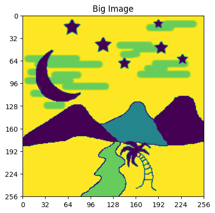
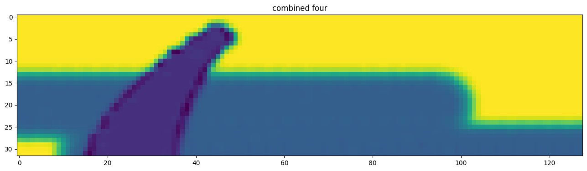
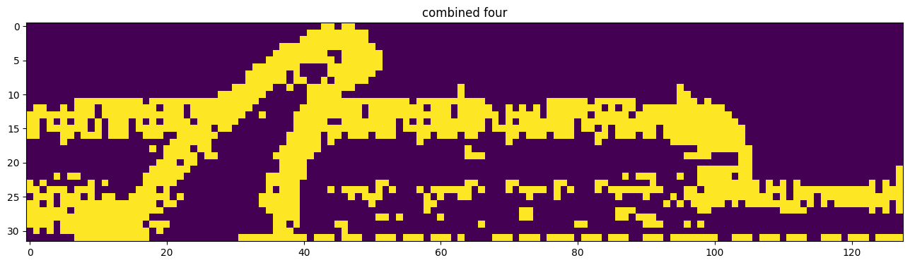

# Quantum Hadamard Edge Detection (QHED) Demonstration

## Overview

This project demonstrates image edge detection using a quantum computer simulator provided by IBM. The implementation is based on the Qiskit library and Python language. Quantum Hadamard Edge Detection (QHED) is a quantum algorithm used for edge detection in images.

## Images Used

- **Large Image**: The original large image used in the project.
- 

  
- **Image Patch**: The part of the image on which QHED is applied.
  
  
- **Output Image**: The resulting output image when QHED is applied over a small part of the original image.
  

## Flow Diagram

Below is the flow diagram for better understanding of the process flow:

## Usage

1. **Setup**: Install the Qiskit library and required dependencies.
2. **Image Preparation**: Select the image you want to apply QHED to and prepare it for processing.
3. **QHED Algorithm**: Run the QHED algorithm on the selected part of the image.
4. **Result Visualization**: Visualize the output image with edges highlighted.

## Files Included

1. `ibm qhed.ipynb`:Jupyter notebook containing the QHED algorithm implementation.
2. `quantum-edge-detection_46_1.jpg`: The original large image used in the project.
3. `input.jpg`: The part of the image on which QHED is applied.
4. `Output Image.jpg`: The resulting output image when QHED is applied over a small part of the original image.
5. `flow_chart.jpg`: Flow diagram illustrating the process flow of the QHED algorithm.
6. `README.md`: Documentation file explaining the project and how to use it.

## Dependencies

This project requires the following:

- Python 3.x
- Qiskit library
- IBM Quantum LAB
- Matplotlib (for image visualization)

## Note

- Experiment with different images and parameters to explore the performance of QHED.
- This implementation is a demonstration and may not be suitable for production use.

## Author

[Kaustubh Gupta]
